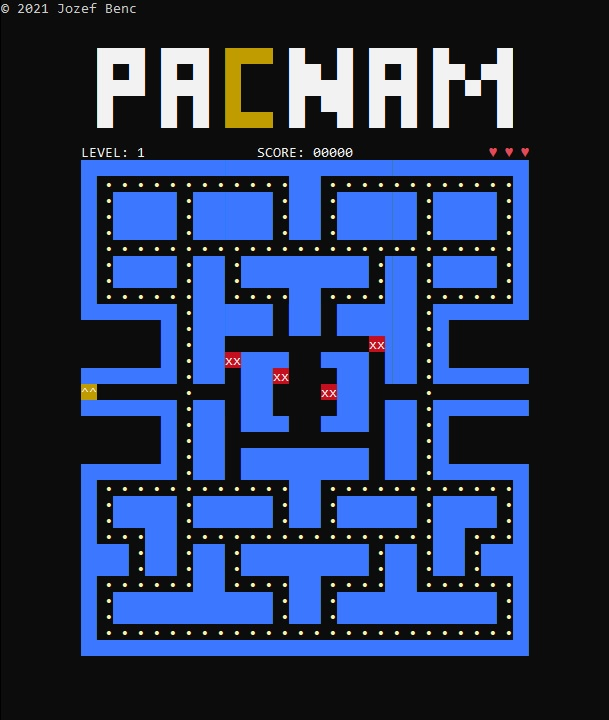

# Pacnam C++ 2021
Hra v konzolovej aplikácii inšpirovaná hrou Pacman.

Využitie OOP v C++11 na OS Windows.

Dátum vytvorenia: apríli 2021.

Použité IDE: Code::Blocks 17.12

Jazyk: slovenčina

Autor: Jozef Benc

Ukážka hry:

